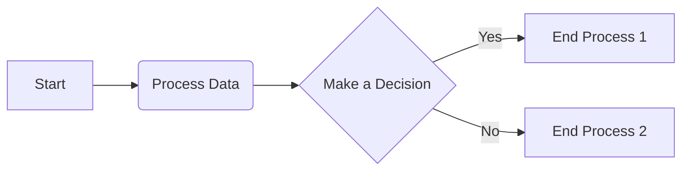
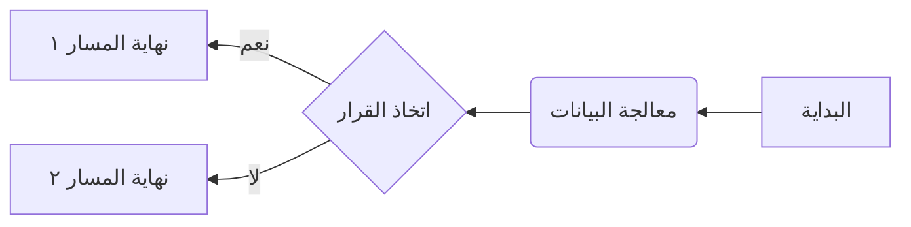
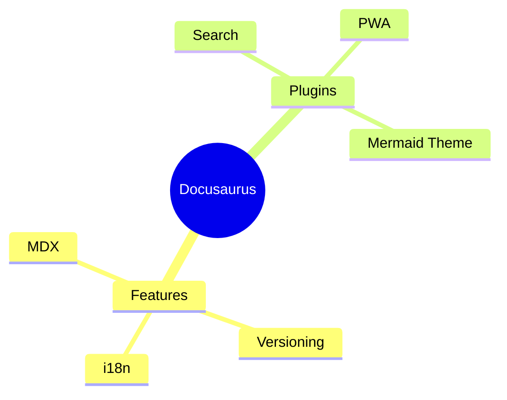
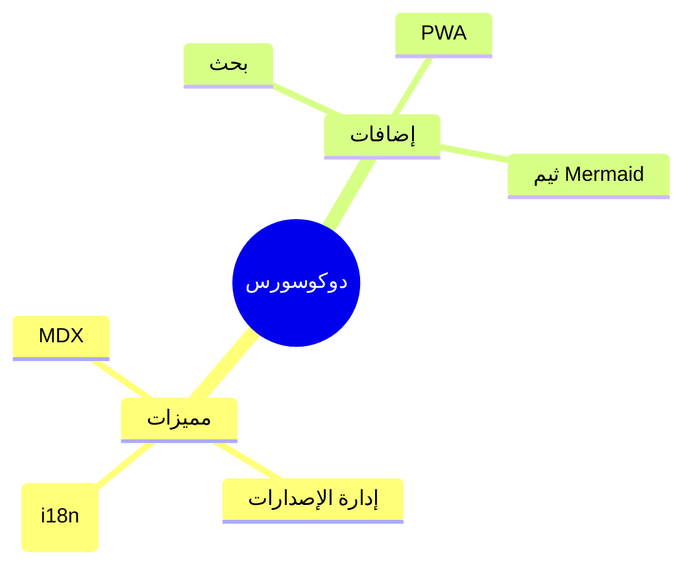

# Panduan Menggunakan Mermaid

Mermaid adalah sebuah *tool* berbasis JavaScript yang memungkinkan Anda membuat diagram dan visualisasi (seperti diagram alir, urutan, atau Gantt chart) menggunakan sintaksis teks yang mirip dengan Markdown.

Docusaurus memiliki dukungan bawaan untuk Mermaid, sehingga Anda bisa langsung menyematkan diagram di dalam file Markdown atau MDX Anda.

## Instalasi dan Konfigurasi

Kabar baiknya, jika Anda menggunakan tema klasik Docusaurus (`@docusaurus/theme-classic`), Mermaid sudah terpasang dan aktif secara default. Anda tidak perlu melakukan instalasi tambahan.

Namun, jika Anda tidak menggunakan tema klasik atau ingin memastikan konfigurasinya benar, ikuti langkah berikut:

1.  **Instal tema Mermaid** (jika belum ada):

    ```bash
    npm install @docusaurus/theme-mermaid
    ```

2.  **Aktifkan di `docusaurus.config.js`**:
    Pastikan tema dan konfigurasi markdown sudah ditambahkan di file konfigurasi Anda.

    ```js title="docusaurus.config.js"
    module.exports = {
      // ...konfigurasi lainnya
      themes: ['@docusaurus/theme-mermaid'],
      markdown: {
        mermaid: true,
      },
    };
    ```

## Cara Penggunaan Dasar

Untuk membuat diagram, cukup buat sebuah blok kode dan tentukan bahasanya sebagai `mermaid`.

````md

````

## Contoh Diagram

Berikut adalah beberapa contoh diagram yang bisa Anda buat.

### 1. Diagram Alir (Flowchart)

Anda bisa mengontrol arah diagram dengan `graph LR` (Left to Right) atau `graph RL` (Right to Left).

**Contoh Kiri ke Kanan (Teks Latin)**



**Contoh Kanan ke Kiri (Teks Arab)**

Untuk teks Arab, gunakan `graph RL` agar alurnya sesuai.



### 2. Peta Pikiran (Mind Map)

Mermaid juga mendukung pembuatan *mind map* untuk memvisualisasikan ide secara hierarkis.

**Contoh Kiri ke Kanan (Teks Latin)**



**Contoh Kanan ke Kiri (Teks Arab)**

Untuk *mind map*, arah teks akan mengikuti pengaturan umum dari tema situs Anda. Jika tema Anda mendukung RTL, teks akan ditampilkan dengan benar.


