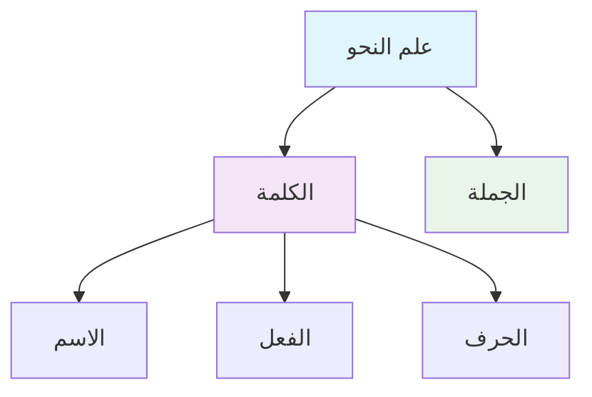
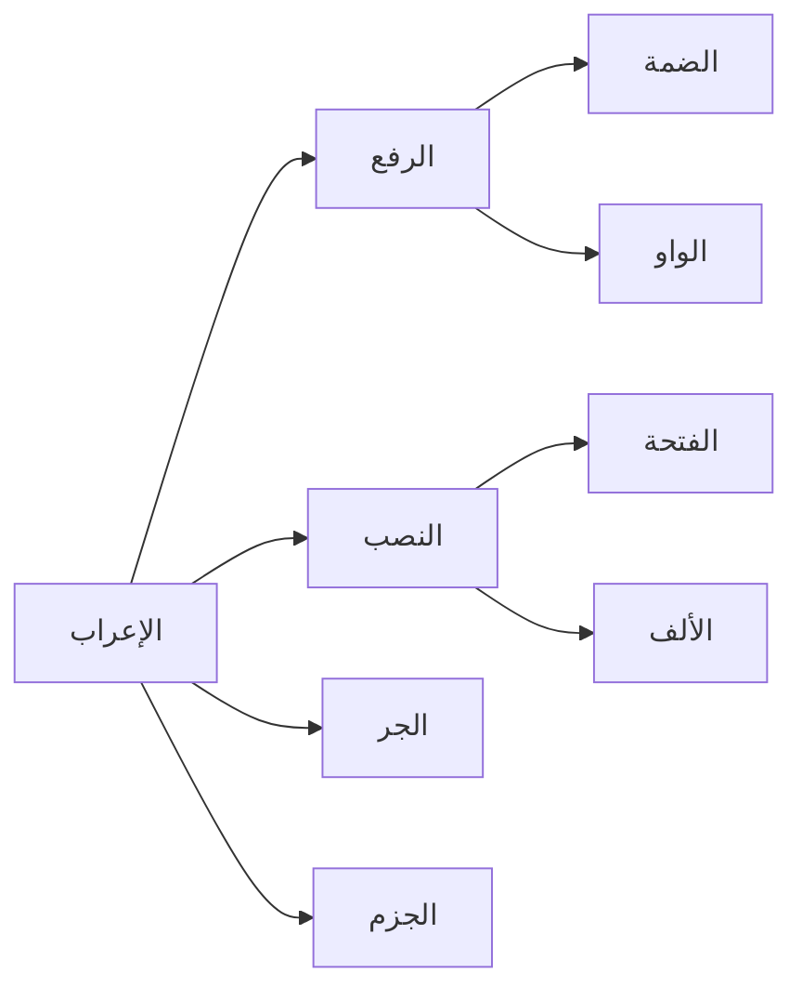

import Mermaid from '@theme/Mermaid';

---
sidebar_position: 1
---

# Pembelajaran Ilmu Nahwu

## Struktur Dasar

```mermaid
graph TD
    A[علم النحو] --> B[الكلمة]
    A --> C[الجملة]
    B --> D[الاسم]
    B --> E[الفعل]
    B --> F[الحرف]
    
    style A fill:#e1f5fe
    style B fill:#f3e5f5
    style C fill:#e8f5e8
```

## I'rob dalam Nahwu

```mermaid
flowchart LR
    A[الإعراب] --> B[الرفع]
    A --> C[النصب]
    A --> D[الجر]
    A --> E[الجزم]
    
    B --> B1[الضمة]
    B --> B2[الواو]
    C --> C1[الفتحة]
    C --> C2[الألف]
```